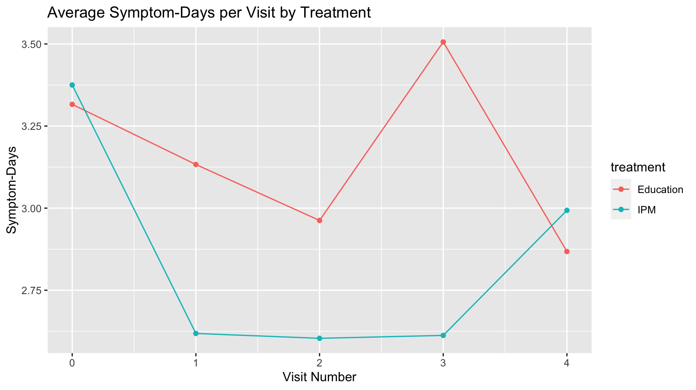

```{r global_options, include=FALSE}
knitr::opts_chunk$set(echo = TRUE, eval = TRUE,  
                      warning = FALSE, message = FALSE, 
                      fig.align = "center",
                      R.options = list(max.print=100))

# Edit the file starting below
```

### Enter your name and EID here:

**You will submit this homework assignment as a PDF file on Gradescope.**

*For all questions, include the R commands/functions that you used to find your answer (show R chunk). Answers without supporting code will not receive credit. Write full sentences to describe your findings.*

------------------------------------------------------------------------

This homework will focus on data from the Mouse Allergen and Asthma Intervention Trial, which we have previously discussed in class. This study looked at the effect of an integrated pest management (IPM) program on improving asthma symptoms. Study subjects were randomized to either recieve the IPM program or to receive education about thge effect of mouse allergen in the home.

The dataset included for this homework contains information on the following variables:

* `hometype` - the type of house/home the subject lived in

* `gender` - self-reported gender

* `income` - category of income for the parent of the subject

* `race` - self reported race

* `ID` - a random identifier string for each study subject

* `visit` - the visit number when data were recorded (ranges from 0 to 4)

* `age` - the subject's age

* `symptomdays` - the number of days with asthma symptoms in the past 2 weeks

* `IgE` - the level of IgE (a marker of allergic response) in the blood 

* `mice.infest` - whether there was evidence of mouse infestation in the home


The dataset can be loaded into R using the `read_csv()` code below. Take a look at the data frame before proceeding with the questions below.

```{r}
library(tidyverse)

maait <- read_csv("maait.csv")
maait
```


### Question 1: (2 pts)

For this question we will look at the data for each individual for what is referred to as their **baseline visit**. The baseline visit for each person is the observation where `visit == 0`. 

Using the `filter()` function, create a separate R object called `baseline` that is a data frame that represents all of the data from visit 0. 

```{r}
## add your code here (and edit this comment to make it descriptive)

```

Using `dplyr` functions, answer the following questions:

1. How many people (study subjects) in the baseline dataset live in an Apartment? 

2. What percentage of all the subjects in the baseline dataset live in an Apartment? 

(Note: See the `hometype` variable for this question.) 

```{r}
## add your code here (and edit this comment to make it descriptive)

```

**Write your answer here.**


### Question 2: (1 pts)

Make a bar plot of of the `hometype` variable in the `baseline` dataset. What is the most common type of home in this dataset?

```{r}
## add your code here (and edit this comment to make it descriptive)

```

**Write your answer here.**


### Question 3: (2 pts)

Using the `baseline` dataset, make a side-by-side boxplot of the `IgE` variable for each `income` category. Make sure both x- and y-axes are readable (optionally use `coord_flip()` if it helps readability). 

1. Which income category has the highest median IgE level?

2. Which income category has the lowest median IgE level?

```{r}
## add your code here (and edit this comment to make it descriptive)

```

**Write your answer here.**


### Question 4: (2 pts)

Using the `baseline` dataset, make a side-by-side boxplot of `symptomdays` vs. `hometype` only amongst people who have evidence of mouse infestation in their home. Which home type appears to have the highest median symptom-days?


```{r}
## add your code here (and edit this comment to make it descriptive)

```

**Write your answer here.**


### Question 5: (3 pts)

Let's look at the relationship between age and IgE levels in the `baseline` dataset and how that relationship might differ between different home types.
Make a scatterplot of `IgE` (y-axis) and `age` (x-axis). What is the overall relationship between these two variables? How does IgE change as age changes?

NOTE: You can highlight the relationship by adding a linear regression line to the plot.

```{r}
## add your code here (and edit this comment to make it descriptive)

```

**Write your answer here.**


Now make the same scatterplot between `IgE` and `age` but now use a separate panel/facet for each `hometype`. Does the relationship between and IgE and age change depending on what type of home you live in? 

NOTE: For this plot, first filter out observations that have the `hometype` of "other".

```{r}
## add your code here (and edit this comment to make it descriptive)

```

**Write your answer here.**


### Question 6: (2 pts)

For this question we will move beyond the baseline dataset and use the full `maait` dataset which contains data from all of the visits (up to 5 visits). 

Each individual in the study is identified in the `ID` column by a random string of digits and letters. If an individual stayed in the study and has data for all 5 visits, then there should be five rows in the dataset containing that person's ID value. 

How many of the individuals have data for all 5 visits?

```{r}
## add your code here (and edit this comment to make it descriptive)

```

**Write your answer here.**


### Question 7: (4 pts)

Let's look at one of the main outcomes of the study, `symptomdays`. This variable measures the number of days in the past 2 weeks that the individual had asthma symptoms. The variable ranges from 0 days to 14 days (i.e. 2 weeks). We want to know whether the `treatment` (IPM vs. Education) had any impact on the `symptomdays`.

Plot the average of `symptomdays` for each visit and plot separate points for the average of the IPM treatment and the average of the Education treatment. Add lines connecting the points for each treatment group. The plot should appear like the one below.



How would you describe the effect of the treatment on symptom-days in this study?

```{r,eval=FALSE}
## add your code here (and edit this comment to make it descriptive)

```


**Write your answer here.**


### Question 8: (2 pts)

We want to look at how the treatment seemed to work for the male and female subjects in the study. Self-reported gender information is recorded in the `gender` variable. Make a side-by-side boxplot of `symtomdays` by `treatment` value and make separate facets/panels for male and female subjects. For this plot we **only want to use data from visit 3 and visit 4**. 

How would you describe the difference in the effect of the treatment on symptoms between male and female study subjects?

```{r}
## add your code here (and edit this comment to make it descriptive)

```

**Write your answer here.**


### Formatting: (2 pts)

Comment your code, write full sentences, and knit your file!

